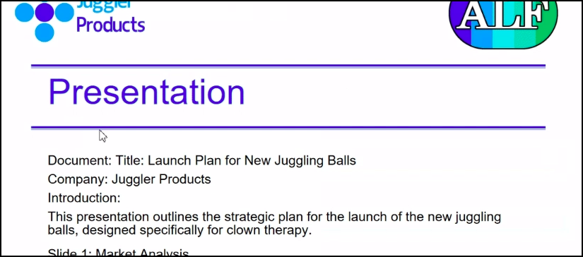

# Behind the Scenes - How the Alfresco AI Assistants Work

It can be hard to understand exactly what is real from a demo, so we wanted to provide an explanation of the various tasks being performed. In general we've tried to use real code and rely on the LLM to solve problems for us whereever possible.

## Show all recent snippets containing "Alan Turing", include all tasks without fail

The main application in the demo is Alfredo the Alfresco AI Assistant. This uses an LLM and LangChain to automatically select the appropriate tool for each task.

For the first task then Alfredo decides to use the `list_recent_content_snippets` tool. It is required to provide a search term, and picks `"Alan Turing"` out of the prompt. The Alfresco search API is invoked to find recent documents containing this term, and returns with a set of extracts from the documents that matched the search query. The LLM is then given the original prompt along with these extracts and uses them to construct a list of tasks.

## Translate "feliz_feedback.txt" to English

The first task that the user selects is to review a document and from the filename and author they immediately know it will be in Spanish. They ask the AI Assistant for an English translation and the LLM selects the `translate_content` tool. It automatically extracts the document title and language from the user prompt and supplies these as arguments. The tool then passes the content of the document to the LLM and requests that it is translated to the supplied language - it's able to automatically determine the source language. The resulting text is streamed to the UI.

## Summarise "cta_feedback.txt" including all important details

The meeting on the 21st of May contained two action items for the user. The second one was to review the feedback document from "Clown Therapy Association." Alfredo uses the prompt to select the `transform_content` tool and passes in the filename. Similar to the `translate_content` tool this makes a second request to the LLM, but this time the internal prompt is much more generic. This tool is capable of producing summaries of documents, determining an arbitrary classification of them (e.g. "Is the document a technical specification or marketing material?") or even rewriting the content as a poem. Here's an example of the last point using a football match report as a source document.

```
Summarise EnglandColombia.txt formatting it as a limerick. Mention some key names.

    There once was a match, England did play
    Against Colombia, on a World Cup day
    Russo did score
    With a goal in store
    Earps and Hemp helped them win the way
```

## Redact all PII in "presentation.txt"

The summary picks out a note from the `cta_feedback.txt` that the presentation currently contains PII and that this must be redacted before it can be published. The user instructs the Assistant AI to redact all PII from `presentation.txt` and the tool correctly selects the `redact_content` tool supplying the title and the instruction of what should be redacted.

The LLM is smart enough to interpret "PII" and to recognise names and email addresses within the specified text. This works with other criteria too and allows users to redact particular types of data, rather than having to specify a full list of terms to redact.

## Generate a "Presentation" pdf report containing the following: "..." (apply appropriate formatting before generating)

The next task is to take the redacted content and produce a pdf report with it. Alfredo decides to use the `create_pdf_report` tool for this. In order to generate the report it needs to supply a title (it chooses `Presentation.pdf`) and the content. Because the user asked it to format the text then it split the text into paragraphs and added appropriate titles. With more time we would have been able to harness markdown or similar to generate the report with even more automated styling.



## Copy the "Presentation.pdf" file to the "Public" folder

In order to publish the document the user needs to put a copy in a particular folder, and Alfredo converts the instruction into a call to `copy_file`. This tool integrates with the Alfresco search tool to find the specified source document and target folder, and then uses the REST API to perform the copy.

## What are the installed ACS modules?

The user wants to find out some system information and this triggers Alfredo to use the `discovery` tool. The API response is sent to the LLM along with the original user request and Alfredo extracts the relevant information and replies with a bullet point list of installed modules.

## [Using Alfresco Docs Bot] Can I obtain direct download links and share objects?

At the start of the Hackathon project we had two goals, and the Docs Bot was completed more quickly than the AI Assistant.

The user uses the Docs Bot to request information from the [Alfresco Docs Site](https://docs.alfresco.com/). We have preprocessed the documentation using our `transformer.py` script and then stored it in a vector database. The Docs Bot uses RAG to supply the LLM with the appropriate information so that it can reply in natural language to user requests.

## Are DAUs enabled in ACS?

The final prompt used by the user is to determine whether a particular feature is available in the ACS installation. This again uses the `discovery` tool, but shows different information being extracted - this time it infers that "DAU" has the same meaning as "Direct Access URL", and that the property `isDirectAccessUrlEnabled` controls this feature.
