# Alfresco AI Assistants

This repository contains several Alfresco [AI Assistants](https://en.wikipedia.org/wiki/Virtual_assistant) to help users
and customers get the information they need or perform complex tasks, simply conveying each request via natural language.

For a "behind the scenes" explanation of what is happening in our demo see [behind_the_scenes.md](behind_the_scenes.md).

## Applications

This repository contains the following applications:

| Name                  | Main files                 | Compose name            | URLs                  | Description                                                                          |
|-----------------------|----------------------------|-------------------------|-----------------------|--------------------------------------------------------------------------------------|
| Alfresco Docs Bot     | `alfresco_docs_bot.py`     | `alfresco_docs_bot`     | http://localhost:8503 | Ingest the Alfresco documentation and ask it questions.                              |
| Alfresco AI Assistant | `alfresco_ai_assistant.py` | `alfresco_ai_assistant` | http://localhost:8504 | Interact with an Alfresco Content Services instance using natural language requests. |

The database can be explored at http://localhost:7474.

### App 1 - Alfresco Docs Bot

```mermaid
graph TB
user(User 👤)
llm(LLM 🤖)
vectordb[(Vector database)]
raw-docs{{Raw Documentation 📚}}

user --query-embedded-data--> vectordb
vectordb --relevant-data--> llm
llm --final answer--> user

raw-docs --extraction/chunking/embedding---> vectordb
```



**Access at**:

- UI: http://localhost:8503
- DB: http://localhost:7474

**Features**:

- answer questions based on the specified product's documentation
- answers will purely be based on Alfresco Docs content

### App 2 - Alfredo, the Alfresco AI Assistant

```mermaid
graph BT
user(User 👤)
llm(LLM 🤖)
api

subgraph api[API 👷]
  discovery-api
  search-api
  node-api
end

subgraph tools[Tools 🛠️]
  discovery
  transform
  redact
end

user --query--> llm

llm --choose--> tools

tools --invoke--> api

api --feed data--> llm

llm --final answer--> user
```



**Access at**:

- UI: http://localhost:8504

**Features**:

- perform complex tasks against a live ACS instance based on human requests
- find and preview documents
- show recent document snippets matching a search term
- transform _(e.g.: translate/summarise/classify)_ documents
- redact documents
- copy a document into a specified folder
- answer questions about the ACS deployment
- generate PDF reports and upload them to ACS

## Configure

Create a `.env` file from the environment template file `env.example`

Available variables:
| Variable Name         | Default value                     | Description                                                                                       |
|-----------------------|-----------------------------------|---------------------------------------------------------------------------------------------------|
| ALFRESCO_URL          | http://localhost:8080             | REQUIRED - Base URL to the ACS instance                                                           |
| ALFRESCO_USERNAME     | admin                             | REQUIRED - Username for the ACS instance                                                          |
| ALFRESCO_PASSWORD     | admin                             | REQUIRED - Password for the ACS instance                                                          |
| OLLAMA_BASE_URL       | http://host.docker.internal:11434 | REQUIRED - URL to Ollama LLM API                                                                  |
| NEO4J_URI             | neo4j://database:7687             | REQUIRED - URL to Neo4j database                                                                  |
| NEO4J_USERNAME        | neo4j                             | REQUIRED - Username for Neo4j database                                                            |
| NEO4J_PASSWORD        | password                          | REQUIRED - Password for Neo4j database                                                            |
| LLM                   | llama3                            | REQUIRED - Can be any Ollama model tag, or gpt-4 or gpt-3.5 or claudev2                           |
| EMBEDDING_MODEL       | sentence_transformer              | REQUIRED - Can be sentence_transformer, openai, aws, ollama or google-genai-embedding-001         |
| AWS_ACCESS_KEY_ID     |                                   | REQUIRED - Only if LLM=claudev2 or embedding_model=aws                                            |
| AWS_SECRET_ACCESS_KEY |                                   | REQUIRED - Only if LLM=claudev2 or embedding_model=aws                                            |
| AWS_DEFAULT_REGION    |                                   | REQUIRED - Only if LLM=claudev2 or embedding_model=aws                                            |
| OPENAI_API_KEY        |                                   | REQUIRED - Only if LLM=gpt-4 or LLM=gpt-3.5 or embedding_model=openai                             |
| GOOGLE_API_KEY        |                                   | REQUIRED - Only required when using GoogleGenai LLM or embedding model google-genai-embedding-001 |
| LANGCHAIN_ENDPOINT    | "https://api.smith.langchain.com" | OPTIONAL - URL to Langchain Smith API                                                             |
| LANGCHAIN_TRACING_V2  | false                             | OPTIONAL - Enable Langchain tracing v2                                                            |
| LANGCHAIN_PROJECT     |                                   | OPTIONAL - Langchain project name                                                                 |
| LANGCHAIN_API_KEY     |                                   | OPTIONAL - Langchain API key                                                                      |

> [!WARNING]
> The applications have been tested only with Ollama, and specifically llama3, they are not guaranteed to work with other LLMs.

### LLM Configuration

#### Ollama

No need to install Ollama manually, it will run in a container as
part of the stack when running with the Linux profile: run `docker compose --profile linux up`.
Make sure to set the `OLLAMA_BASE_URL=http://llm:11434` in the `.env` file when using Ollama docker container.

To use the Linux-GPU profile: run `docker compose --profile linux-gpu up`. Also change `OLLAMA_BASE_URL=http://llm-gpu:11434` in the `.env` file.

If, for whatever reason, you're unable to run the Ollama container, you can instead install it and run it locally as an alternative option.

> You may want to reduce `num_ctx` to `3072` in [commons.py](commons.py) if you
> are running on cheap GPU or CPU.

#### Ollama on EKS

Running Ollama locally may yield slow results. A possible solution is to run it
on a cheap GPU-enabled EC2 instance which will perform better than any consumer
grade GPU.

To create an EKS cluster backed by a single `g4dn.xlarge` instance:

```sh
eksctl create cluster --name hack-turing-titans --node-type=g4dn.xlarge --nodes 1
```

Install ingress-nginx and cert-manager to expose ollama via https:

```sh
helm upgrade --install ingress-nginx ingress-nginx \
--repo https://kubernetes.github.io/ingress-nginx \
--namespace ingress-nginx --create-namespace
```

```sh
helm install \
cert-manager jetstack/cert-manager \
--namespace cert-manager \
--create-namespace \
--set installCRDs=true
```

Manually create a DNS record pointing to the ingress-nginx ingress CNAME
(retrieve it via `kubectl get service -n ingress-nginx`).

Set your FQDN and apply the ClusterIssuer resource to enable LetsEncrypt
certificates generation:

```sh
sed -i 's/my-ollama.example.com/YOUR_FQDN/g' k8s/letsencrypt-prod.yaml
kubectl apply -f k8s/letsencrypt-prod.yaml
```

Finally install [Ollama chart](https://github.com/otwld/ollama-helm):

```sh
helm install ollama ollama-helm/ollama \
--namespace ollama \
--create-namespace \
--values ollama.yaml
```

## Develop

> [!WARNING]
> There is a performance issue that impacts python applications in the `4.24.x` releases of Docker Desktop. Please upgrade to the latest release before using this stack.

**To start everything**

```sh
docker compose up
```

If changes to build scripts have been made, **rebuild**.

```sh
docker compose up --build
```

To enter **watch mode** (auto rebuild on file changes).
First start everything, then in new terminal:

```sh
docker compose watch
```

**Shutdown**
If health check fails or containers don't start up as expected, shutdown
completely to start up again.

```sh
docker compose down
```

## Scripts

Scripts that may be required to prepare data for the applications to run correctly, they can all be found under [./scripts](./scripts/).

### transformer.py

[transformer.py](./scripts/transformer.py) is a script that should be run against a local clone of the [docs-alfresco](https://github.com/Alfresco/docs-alfresco)
repository in order to create the `initial-load` folder with all the expected documentation for the Alfresco Docs bot.
